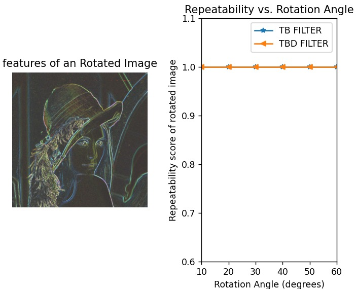

# Directional Intensified Feature Descriptor

Feature descriptors encode necessary information into a series of numbers and act as a  numerical “fingerprint” that can be used to differentiate one feature from another. It is the fundamental process of computer vision applications.

## Description

Feature extraction of our model utilizes "Tri-ocular", "Bi-ocular", and "Dia-ocular" filter for the feature selection. Oxford dataset is used for the feature testing and validation. DITF Model improves the robustness of the model and hence it is proved in terms of Repeatability score.

## Getting Started
## ⚙️ Setup
Assuming a fresh [Anaconda](https://www.anaconda.com/download/) distribution, you can install dependencies with:

```shell
conda env create -f Directional Intensified Feature Descriptor.yml
conda activate Directionalintensifiedfeaturedescriptor
```
Data and dependencies of our program
```
## Data
To download and prepare the Oxford dataset, please use the link ([https://www.robots.ox.ac.uk/~vgg/research/affine/index.html]).

### Dependencies
* python 3.10
* Install numpy 1.26.1 ,matplotlib 3.8.1, opencv 4.8.1.78, scikitimage 0.22.0.
* Windows and ubuntu

### Installing
Clone the repo
* git clone https://github.com/Johnchristopherclement/Directional-Intensified-Feature-Descriptor.git

```
Execution of the model
```
### Executing program

* How to run the program
* run python main.py


## 🖼️ Compositing




```
Metrics
```
## 📊 Evaluation
For evaluation of DITF Model we provided the Repeatability score validation.

## Authors

Contributors names and contact info

Name. Johnchristopherclement
Email. [@gmail.com]


